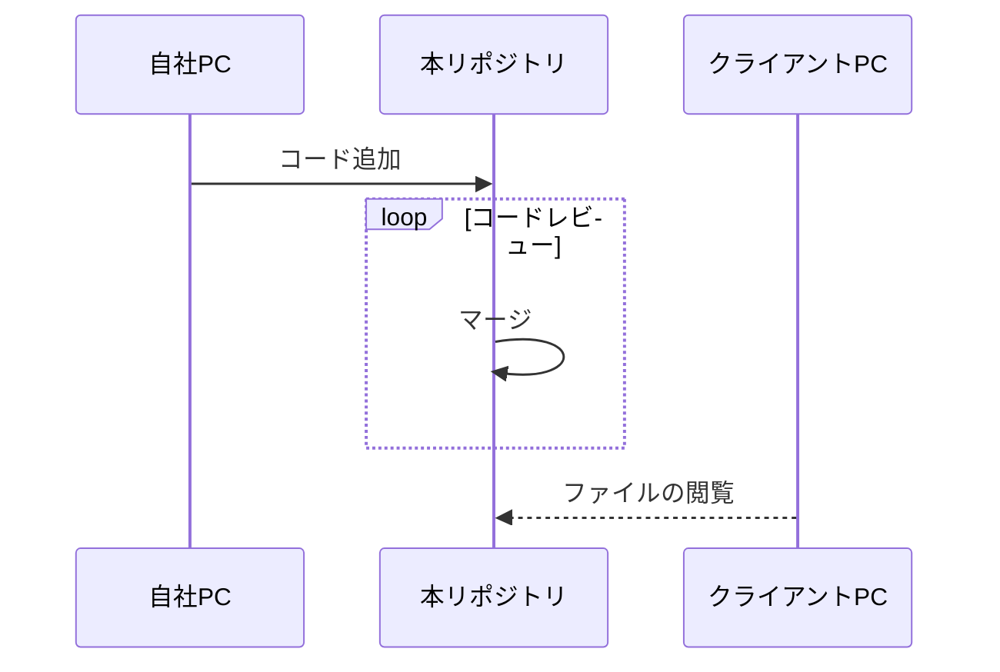
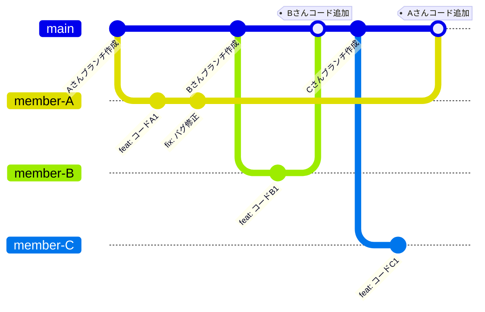

# ググっても出てこないことをGitHubにまとめよう
本リポジトリでは、ググっても簡単には出てこないコードや、つい忘れてしまうコードをまとめる。  
  
現在の対象は下記の通り
- Pandas（DataFrameを使った前処理など）  
- Python（Pandasを使わない処理）

>以下の項目については未着手
>- Matplotlib
>- SQL
>- Tableau
   
---
## 活用方法

  
### コードの閲覧・利用
ブラウザで本リポジトリのmainブランチにアクセスする。
  
### 質問・要望の追加
ブラウザで本リポジトリにアクセスし、Issuesに質問・要望を追加する。

### コードの追加
1. リポジトリのcloneを実行する  
2. 新しくブランチを作成する
3. 追加コードをcommitし、pull request(PR)を作成する  
4. 管理者によりPRが承認されたらmainにmergeする  
  
## 開発イメージ
各メンバーがmainから新しくブランチを作成し、追加したコードをmainにマージしてノウハウを蓄積していく。  
mainに直接pushすることは禁ずる。  

  
---
## リポジトリのクローン
>Mac OSでの作業を想定。
### Terminalでの作業
1. 秘密鍵を生成（色々聞かれるけど全てEnterかyを入力でok）  
`ssh-keygen -t rsa`
2. 以下のコマンドで秘密鍵の中身をクリップボードにコピー  
`pbcopy < ~/.ssh/id_rsa.pub`  
> ※秘密鍵が流出するとGitHubのアカウントが誰でも使えてしまうので取扱注意
  
### GitHubでの作業
1. 右上のアカウントのアイコンをクリックし、Settingsをクリック
1. Accessの中のSSH and GPG keysをクリック
1. New SSH keyをクリック
1. Titleを適当に入力し、Keyに秘密鍵の中身を`Command + V`でペースト
1. Add SSH Keyをクリック
  
### Terminalでの作業
1. ホームディレクトリに移動  
`cd ~`
1. ディレクトリを作成して移動（devはフォルダ名なので自分の好きなように変えてok）  
`mkdir dev; cd $_`
1. リポジトリをclone  
`git clone git@github.com:Taichi-Ibi/ggg.git`
1. Finderでdevフォルダに移動してipynbファイルが動くことを確認する
  
### コードの追加手順
1. 新しくブランチを作成しチェックアウトする
1. script/ipynbの内のipynbファイルやdocument/mdの内のmdファイルを編集し保存する
1. before_commit.pyを実行する
    - ipynbファイルの実行回数の初期化、空白セルの削除、pyファイルの生成を行うスクリプト
    - nbconvertの実行時にエラーが出た場合は、`pip install nbconvert`でnbconvertをインストールする
1. Gitにpushしpull requestを作成する
1. 有用なコードと判断された場合、mainブランチにマージできる（技術共有1回とカウント）
  
---
## ディレクトリ構成
```
.
├── document # Taleauなどのテクニックをドキュメント形式でまとめる
│   └── md
├── module # sqlite3などでsample_dataを扱うための自作モジュール
├── sample_data
├── script # PythonやSQLのテクニックをまとめる
│   ├── ipynb
│   └── py # ipynbファイルから生成されたpyファイル（コードのdiff閲覧に使用）
├── before_commit.py # コミット前に実行するファイル
└── README.md
```
  
---
## サンプルデータについて
データサイエンス100本ノック（構造化データ加工編）のデータ一式を引用しております。  

---
## 参考文献
- Slatkin B., & ブレットスラットキン. (2020). Effective Python: Pythonプログラムを改良する90項目.
- 本橋智光. (2018). 前処理大全: データ分析のためのSQL/R/Python実践テクニック.
- van Rossum G. (2021). Pythonチュートリアル.
- Boswell D., & Foucher T. (2012). リーダブルコード: より良いコードを書くためのシンプルで実践的なテクニック. O’Reilly Media.
- 森谷和弘, & 鈴木雅也. (2022). データサイエンス100本ノック構造化データ加工編ガイドブック.
- 下山輝昌, 松田雄馬, & 三木孝行. (2022). Python実践ﾃﾞｰﾀ分析100本ﾉｯｸ第2版. 秀和システム.